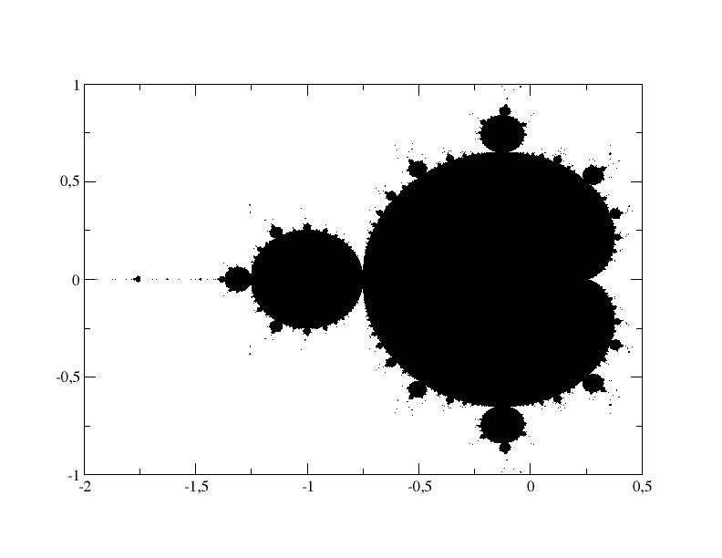

# Mandelbrot.c
C é um ponto do plano. O programa consiste simplesmente em testar se C pertence ao conjunto de Mandelbrot. É possível demostrar que C pertence ao conjunto de Mandelbrot se

permanece sempre menor que 2.

Com

